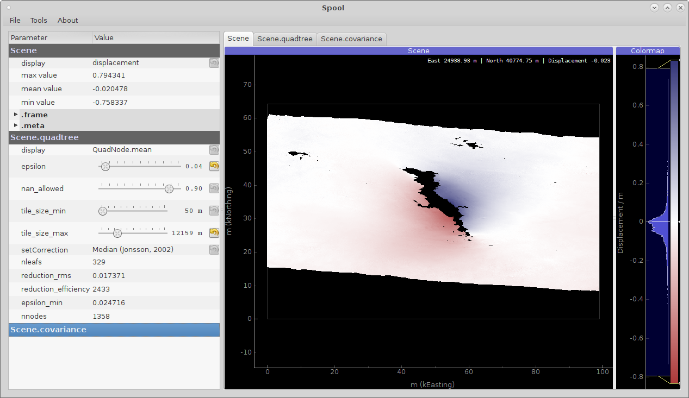

InSAR Scene Inspection with ``Spool``
=====================================
InSAR displacement scenes are complex visual datasets, the ``Spool`` user interface offers interactive and intuitive analysis and **parametrization** of all aspects of the container

    * :doc:`../reference/kite.scene`,
    * :doc:`../reference/kite.quadtree`
    * and :doc:`../reference/kite.covariance`

.. note :: Naming conventions in the GUI represent the :class:`kite.Scene` syntax!

A usage scenario for the scenario could look like this - start the GUI:

.. code-block :: sh

    spool --load test/data/20110214_20110401_ml4_sm.unw.geo_ig_dsc_ionnocorr.mat

.. note ::
    The dataset is part of the `GitHub repository <https://github.com/pyrocko/kite>`_.

Parametrization of the :class:`~kite.Quadtree` and :class:`~kite.Covariance` through the interface is shown in the latter paragraphs of this page.
From :command:`spool` we can save the scene and it's quadtree and covariance parametrization through :menuselection:`File --> &Save Scene`. Let's save the scene as :file:`/tmp/myanmar_2011.[npz,yml]`.

Now we can utilize ``kite``\'s python framework to work with the subsampled quadtree and errors/weights.

.. code-block :: python

    from kite import Scene
    sc = Scene.load('/tmp/myanmar_2011.yml')

    # Get the total leaf weight
    leaf_weights = []
    for l in sc.quadtree.leafs:
        leaf_weights.append((l.id, l.weight))
        # sc.covariance.getWeight(l) == l.weight
        # True

    # Get the covariance
    cross_weights = []
    for l1 in sc.quadtree.leafs:
        for l2 in sc.quadtree.leafs:
            w = sc.covariance.getLeafCovariance(l1, l2)
            cross_weights.append((l1.id, l2.id, w))

LOS Displacement inspection
----------------------------

The first tab offers simple data inspection of plain parameters. From the side menu we can choose displacement, :abbr:`Line of Sight (LOS)` incident angles and unit their georeferenced unit vectors. :guilabel:`display` offers the components ``displacement, phi, theta, thetaDeg, degPhi, unitE, unitN, unitU``.

    An unwrapped InSAR displacement scene from a 2011 Myanmar strike-slip event (Sudhaus and Gomba, 2016 [#f1]_). Red color shows displacement away from the satellite, blue displacement towards LOS.

.. _spool-quadtree:

Quadtree manipulation
----------------------

The :class:`~kite.Quadtree` subsamples the InSAR displacement in order to have a reduced and thus more manageable dataset for modelling.

The four parameters characterizing the quadtree can be controlled through the gui (see also :doc:`../examples/quadtree`)

* epsilon/std threshold (:attr:`~kite.Quadtree.epsilon`)
* Fraction of NaN values within (:attr:`~kite.Quadtree.nan_allowed`)
* Maximum and minimum dimension of the tile
  (:attr:`~kite.Quadtree.tile_size_max` and :attr:`~kite.Quadtree.tile_size_min`)

.. figure:: ../../_images/spool-quadtree_mean.png
    :alt: Quadtree parametrization and properties

    Interactive quadtree parametrization through the :command:`spool` GUI. Shown here is the mean displacement of the leafs (:attr:`kite.quadtree.QuadNode.mean`).

To get a feel for the covariance and error estimation we can have a look at the absolute weights of the leafs (see :attr:`kite.quadtree.QuadNode.weight` or :func:`kite.Covariance.getLeafWeight`).

.. figure:: ../../_images/spool-quadtree_weight.png
    :alt: Quadtree nodes with associated errors/weights derived from kite.Covariance

    Absolute weight of each :class:`~kite.quadtree.QuadNode` derived from :class:`~kite.Covariance`. Yellow is low weight, blue are higher weighted leafs.

.. _spool-covariance:

Covariance parametrisation
----------------------------

The covariance of the InSAR scene is a measure for the noise which affects our deformation signal. In order to generate a reasonable geodynamic model we need to quantify the contribution of noise to our signal. A common model for the noise contributionin satellite interferometry is:

.. math ::

    d_{total} = d_{signal} + [d_{atmosphere} + d_{topography} + d_{err_baseline} + d_{other}]

.. figure:: ../../_images/spool-covariance.png
    :alt: Covariance parametrization through spool GUI

    Covariance parametrization through the GUI. The center panels shows the noise selector (green), the 2D plots illustrate (from top) :attr:`~kite.Covariance.covariance_func`, :attr:`~kite.Covariance.structure_func` and the :func:`~kite.Covariance.noiseSpectrum`.

.. figure:: ../../_images/spool-covariance_noise.png
    :width: 50%
    :align: center
    :alt: Noise patch used for covariance/error analysis

    **Right click** on the noise spectrum or :menuselection:`Tools --> Covariance &Noise Data` brings up the noise inspection window showing :attr:`~kite.Covariance.noise_data`. Before the Fouriere transformation the data is deramped in 2D as well as demeaned.

.. rubric:: References

.. [#f1]  Sudhaus, Henriette and Gomba, Giorgio (2016) Influences of ionospheric disturbances in L-band InSAR data on earthquake source modelling. Living Planet Symposium 2016, 9-13 May 2016, Prague, Czech Republic.
