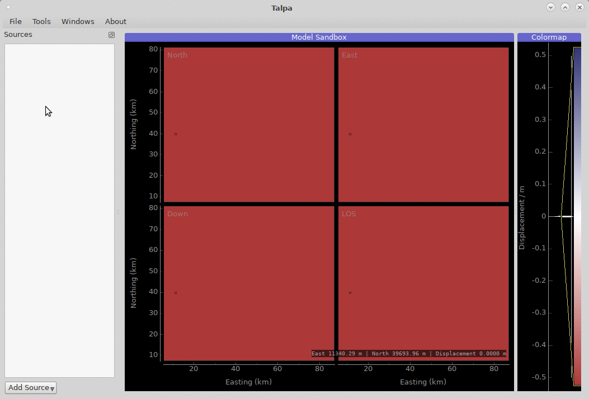
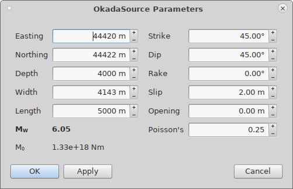

.. _talpa:

Static Displacement Modelling with ``Talpa``
============================================

The tool ``talpa`` (`Talpidae; the mole`) enables interactive modelling of static displacement sources.

It acts as a front end for :mod:`kite.SandboxScene`, a modelling sandbox for InSAR scenes.

Examples for a programmatic interaction with the sandbox can be found :doc:`/examples/sandbox`.

Available Static Displacement Sources
-------------------------------------

The :mod:`~kite.SandboxScene` can hosts different types of displacement source by levering different processing engines, analytical and numerical. The different types of displacement source can be mixed within a single sandbox

1. Okada Source
~~~~~~~~~~~~~~~~

A basic analytical displacement source is :class:`~kite.sources.OkadaSource`. We will use an Okada source in examples below, however the other's sources handling is similar.

2. Pyrocko Sources
~~~~~~~~~~~~~~~~~~

We leverage different sources from Pyrocko. These sources need a pre-build Green's function store, which enable layered half-space models. (see https://pyrocko.org/current/apps/fomosto/index.html)

Implemented source types - Point sources and extended.

* :class:`~kite.sources.PyrockoRectangularSource`
* :class:`~kite.sources.PyrockoMomentTensor`
* :class:`~kite.sources.PyrockoDoubleCouple`
* :class:`~kite.sources.PyrockoRingfaultSource`

3. Compound Dislocation Sources
~~~~~~~~~~~~~~~~~~~~~~~~~~~~~~~

Analytical dilatation point sources extending Mogi sources are implemented in ``kite``:

* :class:`~kite.sources.EllipsoidSource`
* :class:`~kite.sources.PointCompoundSource`

for more information see http://www.volcanodeformation.com and [#f1]_.

.. [#f1] Nikkhoo, M., Walter, T. R., Lundgren, P. R., Prats-Iraola, P. (2017): Compound dislocation models (CDMs) for volcano deformation analyses. - Geophysical Journal International, 208, 2, p. 877-894.

Adding Sources
---------------------------

A selection of different displacement sources can be added to the modelling sandbox by right clicking on the source list.

    Adding a source to the :class:`kite.SandboxScene` using the GUI.

Manipulating Sources
----------------------------------

The spatial parameters of the the sandbox's source can be interacted with by click-and-drag. Advanced parameters, in this case dip, rake and slip are accesses through the editing dialog.

.. figure:: ../../_images/talpa-src_mod.gif
    :width: 80%
    :align: center

    Interactive manipulation of a :class:`~kite.sources.OkadaSource` within the sandbox.

Parametrisation through the source's editing dialog (:menuselection:`<right-click> --> Edit`).

    Source parameter dialog for an :class:`~kite.sources.OkadaSource`.

Saving and Loading a Sandbox
----------------------------

The scene can be saved and loaded through the :menuselection:`File` menu.
